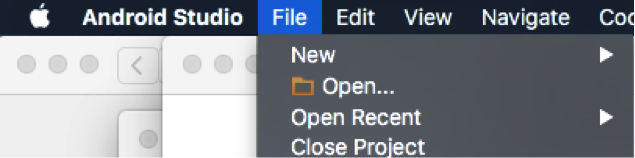
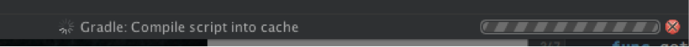
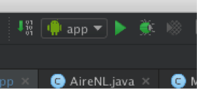
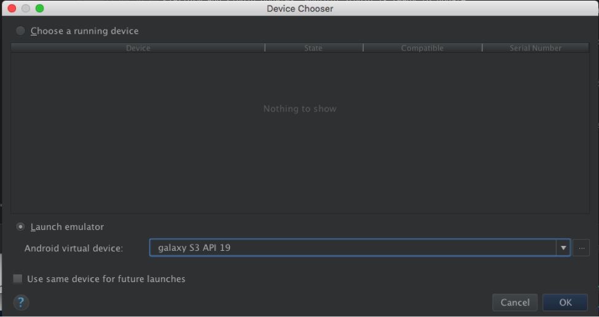

#AireNL-Android

## Requerimientos de Sistema

Para poder correr el proyecto se necesita

* Un sistema operativo Windows 8/7/Vista (32 ó 64-bit), Mac OS X 10.8.5, ó Linux GNOME ó KDE desktop con glibc 2.15 o mas alto
* Tener Android Studio con una version mayor o igual a 1.3.2
* Java Development Kit (JDK) 7 
* Instalar la última versión de Fabric y tener los permisos correspondientes en la app en línea de Fabric.

## Instalación

1. Una vez cumplidos los requerimientos anteriores, para poder correr el proyecto es necesario abrir android studio.
2. Seleccionar en la barra de herramientas Abrir y seleccionar el folder donde se encuentra el proyecto 
 
Gradle automaticamente descargara las dependencias necesarias 
 
3. Una vez que termine de descargar las dependencias seleccionar correr 

4. Aparecerá un menú donde puedes seleccionar el dispositivo o emulador donde correr el build 
 
5. Seleccionar Ok y listo

## Librerías, Frameworks, IDE y herramientas usadas

* Blurry - Librería para crear las imágenes con blur
* Gson - Librería usada para parsear el JSON que se recibe del servidor
* Retrofit - Librería para manejar las peticiones REST al servidor
* twowayview - Librería usada para poder tener listas horizontales dinámicas
* Fabric - Framework usado para el reporte de bugs (Crashlytics)
* leakcanary - Librería de ayuda para detectar leaks
* Android Studio - IDE usado para el desarrollo de la app
* Gradle - Usado para el manejo de dependencias (viene integrado con Android Studio)
